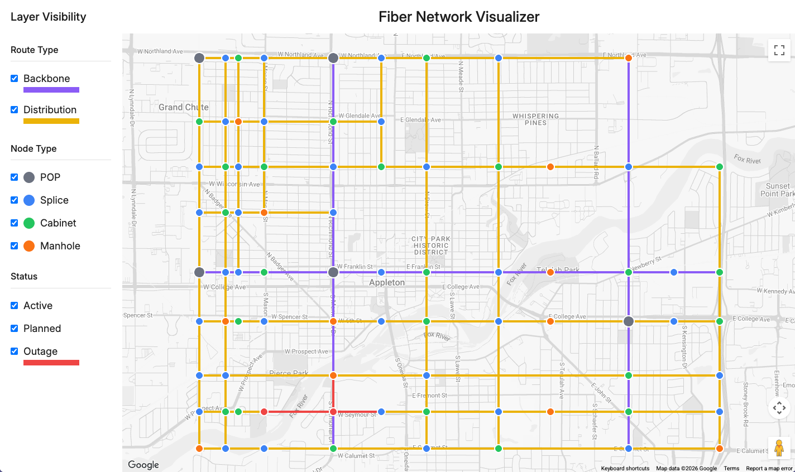

# React Fiber Network Visualizer

A project that visualizes a fictional fiber optic network overlaid on a real map of Appleton, WI. The application displays network nodes and fiber routes on a Google Maps interface, allowing users to filter by route type, node type, and status. All network data is fabricated — this is not a real fiber deployment. It was built to demonstrate interactive map-based data visualization with React, TypeScript, and the Google Maps API.

## Data Generation

The GeoJSON data in `public/data/` uses coordinates based on real Appleton street geometry. Street centerline shapefiles were downloaded from appletonwi.gov and converted from the NAD 1983 HARN WISCRS Outagamie County Feet projection to WGS84 lat/lng using [proj4](https://www.npmjs.com/package/proj4). Those coordinates were then used to place fabricated network infrastructure along actual streets.

## Live Demo

[https://mikebostone.com/projects/react-fiber-network-visualizer](https://mikebostone.com/projects/react-fiber-network-visualizer)

## Screenshots

